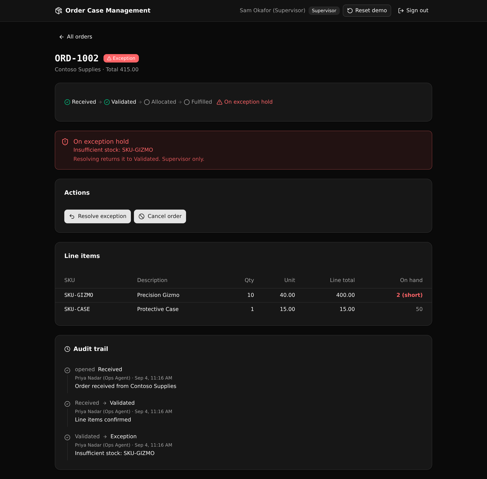

# Order Case Management Backend

A governed order operations backend. Every order is a case that moves through an
enforced state machine, role checks at the API layer decide who can advance or
hold it, and every transition is written to an audit trail with the actor and the
reason.

**7 tables · 11 endpoints · 3 API groups**



## What it demonstrates

This is a **Play 2 (Backend Modernization)** proof for order operations, the kind
of thing a legacy monolith holds today. The point is that the business logic such
a monolith scatters across services lives here in one readable Xano API layer:

- An **enforced state machine**. An order goes received, validated, allocated,
  fulfilled, with an exception hold and a cancel. Illegal jumps are blocked with a
  clear status and message.
- **Native RBAC at the API layer.** Three roles (ops agent, supervisor, viewer).
  Each endpoint reads the caller and checks the role in a precondition, so a viewer
  cannot transition an order and only a supervisor can resolve or cancel one. This
  is middleware and role checks, not row-level security.
- A **stock-allocation guard.** Allocating an order checks inventory line by line.
  If every line is covered it reserves stock and decrements it. If any line is
  short, the order drops to an exception hold with the reason instead, and nothing
  is reserved.
- An **append-only audit trail.** Every transition writes one row with who acted
  and why, so the full history of a case reads back in order.

A technical evaluator can open the repo, deploy it, sign in as each role, and read
exactly where each rule is enforced.

## Repo layout

```
xano/
  index.ts          the workspace, registering every table, group, and query
  tables/           users, customers, orders, line_items, inventory, allocations, order_events
  api/groups.ts     the auth, orders, and seed API groups (canonical slugs pinned)
  api/*.ts          one query per endpoint, each with its rule in a precondition
  seed-data.ts      the demo fixtures (shared by the table seeds and the reset endpoint)
frontend/
  src/lib/api.ts    the one contract: paths and types derived from the query defs
  src/components/    Login, OrdersList, OrderDetail
docs/               this landing page and the screenshot
```

## API surface

| Verb | Path | What it enforces |
| --- | --- | --- |
| POST | `/api:auth/login` | Mints an auth token. Same 401 on a bad email or a bad password. |
| POST | `/api:orders/create` | Ops or supervisor only. Requires a real customer. Totals the lines on the server. Opens the audit trail. |
| POST | `/api:orders/validate` | received to validated. Needs at least one line item. |
| POST | `/api:orders/allocate` | validated to allocated. Checks stock per line, then reserves and decrements, or holds on exception. |
| POST | `/api:orders/fulfill` | allocated to fulfilled. |
| POST | `/api:orders/exception` | Puts an active order on exception hold with a reason, and stashes the state to return to. |
| POST | `/api:orders/resolve` | Supervisor only. Returns the order to its pre-exception state and clears the reason. |
| POST | `/api:orders/cancel` | Supervisor only. Cancels an order that is not already fulfilled or cancelled. |
| GET | `/api:orders/list` | Any signed-in role. Orders newest first, their customers, and stock on hand. |
| GET | `/api:orders/get/{order_id}` | Any signed-in role. One order with lines, allocations, the event timeline, actors, and stock. |
| POST | `/api:seed/run` | Public. Resets the demo orders, lines, events, and stock. |

## Quick start

```sh
git clone https://github.com/xano-scratch/order-case-management-backend
cd order-case-management-backend
npm install
npx xanots login        # one-time sign in with Xano
npm run xano:deploy     # builds the frontend, deploys, self-seeds, prints the live URL
```

The deploy prints a live URL. Open it and sign in with a demo account (password
`demo1234`):

- `ops@demo.test` (ops agent) advances orders.
- `super@demo.test` (supervisor) can also resolve and cancel.
- `view@demo.test` (viewer) can read but cannot transition.

One order (ORD-1002) is already on the insufficient-stock exception, so the
governed path is visible the moment the app opens.

## How the one contract works

`frontend/src/lib/api.ts` imports the query defs and reads `getPath()` and the
`InferInput` / `InferResponse` types straight from them. No request path or body
shape is hand-typed. Change a table or an endpoint, and the frontend types follow
or the build fails. That is the guarantee: the backend and the UI cannot drift.

## FAQ

**Is the auth row-level security?** No. Access is checked at the API layer. Each
protected endpoint reads the caller and runs a role precondition. There is no
row-level security anywhere.

**Where is the business logic?** In `xano/api/*.ts`. Each endpoint is a short,
typed stack, and its rule is a precondition you can read at a glance.

**Can I reset the demo?** Yes. Use the Reset demo button in the header, or POST
`/api:seed/run`. It rebuilds the sample orders and restores stock. It leaves the
accounts in place.

**Are the demo accounts real credentials?** No. They are public demo logins for a
disposable environment, not real users.

**Is this a production system?** No. It is a scratch proof artifact you can read
and run, not a live customer reference.
